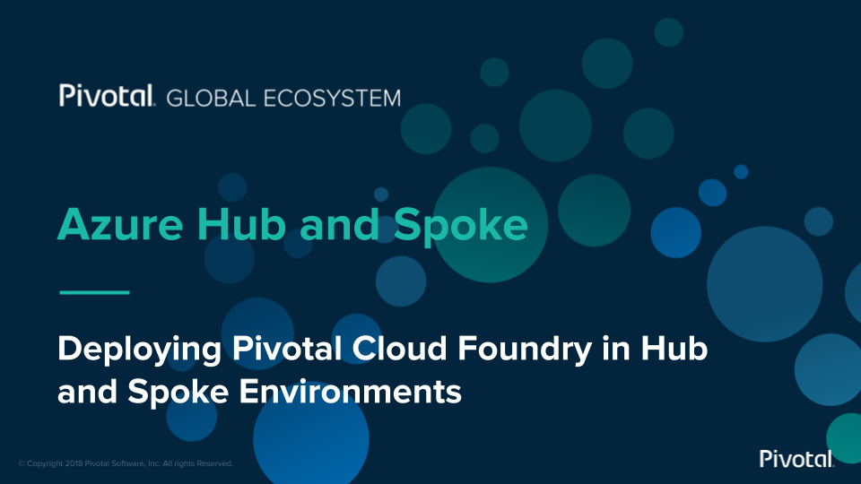
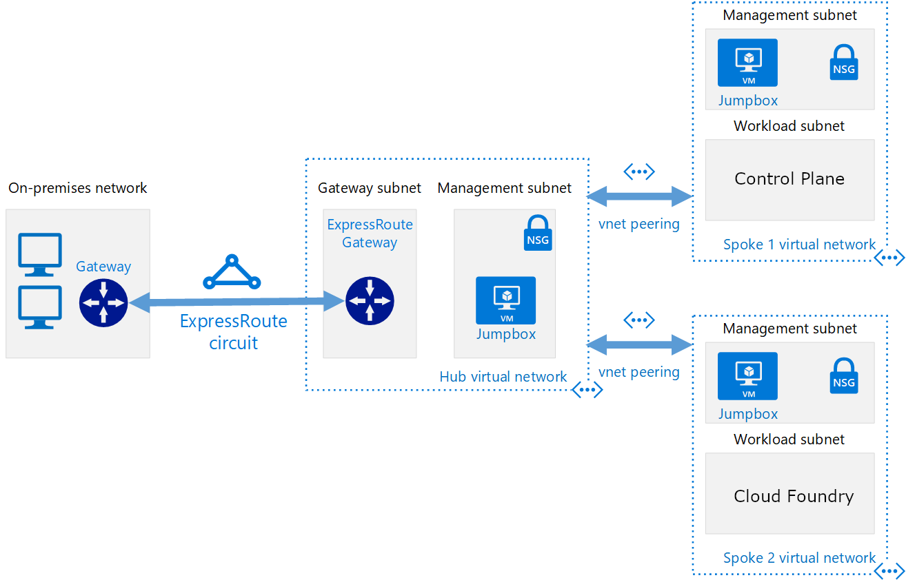

# Azure Reference Architecture with Pivotal Cloud Foundry

This lab will guide you through the deployment of the network components necessary to mimic the Hub and Spoke network architecture as it relates to Pivotal Cloud Foundry and Pivotal Control Plane.

Below is the basic architecture of what this lab will have you set up. In parallel you will also be deploying both Pivotal Control Plane and Pivotal Application Service onto two preconfigured VNets.

## Create Network Resources for Control Plane

