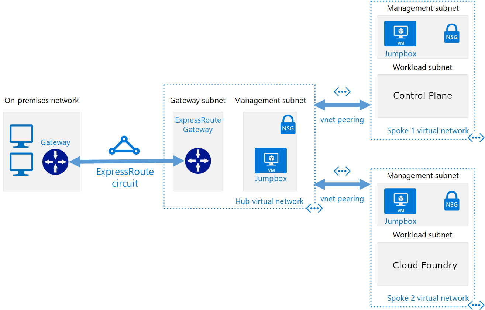

# Azure Reference Architecture with Pivotal Cloud Foundry

This lab will guide you through the deployment of the network components necessary to mimic the Hub and Spoke network architecture as it relates to Pivotal Cloud Foundry and Pivotal Control Plane.

Below is the basic architecture of what this lab will have you set up. In parallel you will also be deploying both Pivotal Control Plane and Pivotal Application Service onto two preconfigured VNets.



## Create Resource Groups for the Topology

We are going to use a total of seven resource groups for this topology. The first three will contain all networking resources for: Central IT, Control Plane and Pivotal Application Service. Then there will be two resource groups used for Central IT resources: DMZ and Network Virtual Appliances. Finally there will be two resource groups for all the Control Plane and PAS resources respectively.

```
az group create -n centralit-network -l westus2
az group create -n centralit-dmz -l westus2
az group create -n centralit-nva -l westus2
az group create -n controlplane-network -l westus2
az group create -n controlplane -l westus2
az group create -n pas-network -l westus2
az group create -n pas -l westus2
```

## Create the Networking Resources

In this section we will deploy all the networking components such that we a Hub Virtual Network with two Subnets for a DMZ and Network Virtual Appliances (NVAs) and then two peered Spoke Virtual Networks that forward all outbound traffic through the Hub.

### Create VNets and Subnets

First we will create each of the three VNets with their subnets.

##### Central IT VNet

```
az network vnet create -g centralit-network \
-n centralit-vnet --address-prefix 10.0.0.0/16 \
--subnet-name dmz --subnet-prefix 10.0.0.0/24

# Create the additional Subnet
az network vnet subnet create -g centralit-network --vnet-name centralit-vnet \
-n nva --address-prefixes 10.0.1.0/24
```

##### Control Plane VNet

```
az network vnet create -g controlplane-network \
-n controlplane-vnet --address-prefix 10.1.0.0/16 \
--subnet-name infrastructure --subnet-prefix 10.1.0.0/24

# Create the additional Subnet
az network vnet subnet create -g controlplane-network --vnet-name controlplane-vnet \
-n controlplane --address-prefixes 10.1.1.0/24
```

##### Pivotal Applicaiton Service VNet

```
az network vnet create -g pas-network \
-n pas-vnet --address-prefix 10.2.0.0/16 \
--subnet-name infrastructure --subnet-prefix 10.2.0.0/24

# Create the additional Subnets
az network vnet subnet create -g pas-network --vnet-name pas-vnet \
-n pas --address-prefixes 10.2.1.0/24

az network vnet subnet create -g pas-network --vnet-name pas-vnet \
-n services --address-prefixes 10.2.2.0/24
```

### VNet Peering

Now that we have the VNets deployed we want to peer them such that all traffic can be forwarded through the Central IT Hub. Follow the instructions below for each peering listed

1. Go to the [Azure Portal](https://portal.azure.com)
1. Click `Resource Groups` on the left and then click on the resource group listed in the peering
1. Inside the resource group you should see the vnet that we created in the second part. Open it
1. Click `Peerings` under `Settings`
1. Add each peering defined below

##### Central IT Peerings

Resource Selection:

* Resource Group: `centralit-network`
* Resource: `centralit-vnet`

Central IT to Control Plane Peering:

* Name: `centralitToControlPlane`
* Virtual Network: `controlplane-vnet (controlplane-network)`
* Configure forwarded traffic settings: `Enabled`

Central IT to Pivotal Application Service Peering:

* Name: `centralitToPAS`
* Virtual Network: `pas-vnet (pas-network)`
* Configure forwarded traffic settings: `Enabled`

##### Control Plane Peering

Resource Selection:

* Resource Group: `controlplane-network`
* Resource: `controlplane-vnet`

Central IT to Control Plane Peering:

* Name: `centralitToControlPlane`
* Virtual Network: `centralit-vnet (centralit-network)`
* Configure forwarded traffic settings: `Enabled`

##### Pivotal Application Service Peering

Resource Selection:

* Resource Group: `pas-network`
* Resource: `pas-vnet`

Central IT to Pivotal Application Service Peering:

* Name: `centralitToPAS`
* Virtual Network: `centralit-vnet (centralit-network)`
* Configure forwarded traffic settings: `Enabled`

#### Validate Peerings

Now that the peerings have been added on all three VNets you can validate that they are indeed connected. 

1. Go to the `centralit-vnet` resource
1. Select `Peerings` under `Settings`
1. Both peerings should be listed as `Connected` under `Peering Status`


### Create Network Security Groups

To ensure all traffic flows in the directions that we want we are going to need to create a few Network Security Groups and add rules to them.

1. Go to the [Azure Portal](https://portal.azure.com)
1. Select `Create a resource` from the top left and then search for a `Network Security Group` and hit `Create`. [Quick link](https://portal.azure.com/#create/Microsoft.NetworkSecurityGroup-ARM)
1. Fill out the Create blade with the information for each NSG found below.
1. Navigate to the Network Security Group you just created. (Go through `Resource Groups` on the left > Click on the Resource Group name that you deployed into > Click on the NSG resource we just created)
1. Add the `Inbound/Outbound security rules` by clicking the corresponding settings link and clicking `Add` at the top
1. Fill out the `Add inbound/outbound security rule

##### Central IT DMZ NSG

This Network Security Group will be used to lock down resources deployed to the DMZ subnet in the Hub Virtual Network.

* Name: `centralit-dmz-sg`
* Subscription: <your-subscription>
* Resource Group: `centralit-network`
* Location: `westus2`


1. Select `Create a resource` from the top left and then search for a `Virtual Network` and hit `Create`. [Quick link](https://portal.azure.com/#create/Microsoft.VirtualNetwork-ARM)
1. Fill out the first blade with the following information
    * Name: `centralit-vnet`
    * Address Space: `10.0.0.0/16`
    * Subscription: <your-subscription>
    * Resource Group: `centralit-network`
    * Location: `West US 2`
    * Subnet> Name: `dmz` Address Range: `10.0.0.0/24`
    * <Leave the rest as is>
1. 
